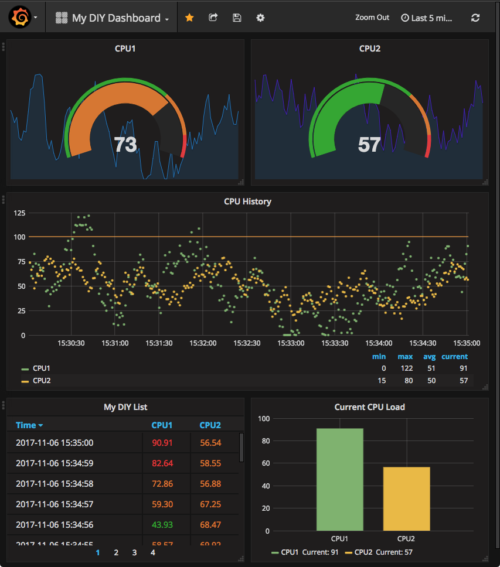

<!--
Usage:

cd $GOPATH/src/github.com/christophberger/grada
godocdown -heading="Title" . > README.md

Use -heading="Title" to comply with the godoc title rules.

Get godocdown at https://github.com/robertkrimen/godocdown

-->

# Grada - A DIY dashboard based on Grafana

Create a DIY dashboard for all metrics generated by your code, using a Grafana dashboard as a frontend.

Whenever you have code that generates time series data (for example, the current CPU load, number of network connections, number of goroutines,...), you can feed this data to a Grafana panel with only a few lines of code.

"Time series data" in this context is nothing more but a floating-point value and a timestamp.



### Package grada is a simple DIY dashboard based on
[Grafana](https://github.com/grafana) and the [Simple JSON Datasource
plugin](https://github.com/grafana/simple-json-datasource).


### The motivation behind Grada

### Grada provides an easy way of monitoring any sort of time series data generated
by your code. Whether you want to observe the number of active goroutines, the
CPU load, the air temperature outside your house, or whatever data source you
can think of - Grada makes it easy to turn that data into graphs, gauges,
histograms, or tables.


### Using Grafana as a dashboard server

I happened to stumble upon Grafana recently. Grafana is a highly configurable
dashboard server for time series databases and other data sources. Quickly, an
idea came to mind: Why not using this for any sort of data generated by my own
code? And this is how Grada was born.

Now whenever you have some data that can be associated with a point in time,
Grada can put this data into a dashboard.


### How to use Grada

In a very dense overview:

    * Create a new dashboard.
    	* Set timeRange to the range that Grafana requests.
    	* Set interval to the interval (in nanoseconds) in which your app delivers data points.
    * Create one or more "Metric", e.g. metric1.
    * Call metric1.Add(...) to add new data points as they appear.
    * Start your app.
    * Install and start Grafana.
    * Create a Grafana dashboard.
    	* Set the dashboard update interval to the one chosen
    * Add a panel (for example, a gauge).
    	* Set its datasource to the metrics created by your app. e.g. metric1, metric2, etc.
    	* The data of the respective metric(s) should now begin to appear in the panel.


### Details and sample code

For more details, see the blog article at https://appliedgo.net/diydashboard as
well as the package API documentation below.

### The article consists of a step-by-step setup of Grafana and a sample app that
produces "fake" time series data.


### Installation and update

### Simply run

    go get -u github.com/christophberger/grada

## Usage

#### type Count

```go
type Count struct {
	N float64
	T time.Time
}
```

Count is a single time series data tuple, consisting of a floating-point value N
and a timestamp T.

#### type Dashboard

```go
type Dashboard struct {
}
```

Dashboard is the central data type of Grada.

Start by creating a new dashboard through GetDashboard().

Then create one or more metrics as needed using CreateMetric() or
CreateMetricWithBufSize().

Finally, have your code add data points to the metric by calling Metric.Add() or
Metric.AddWithTime().

#### func  GetDashboard

```go
func GetDashboard() *Dashboard
```
GetDashboard initializes and/or returns the only existing dashboard. This also
starts the HTTP server that responds to queries from Grafana. Default port is
3001. Overwrite this port by setting the environment variable GRADA_PORT to the
desired port number.

#### func (*Dashboard) CreateMetric

```go
func (d *Dashboard) CreateMetric(target string, timeRange, interval time.Duration) (*Metric, error)
```
CreateMetric creates a new metric for the given target name, time range, and
data update interval, and stores this metric in the server.

A metric is a named data stream for time series data. A Grafana dashboard panel
connects to a data stream based on the metric name selected in the panel
settings.

timeRange is the maximum time range the Grafana dashboard will ask for. This
depends on the user setting for the dashboard.

interval is the (average) interval in which the data points get delivered.

The quotient of timeRange and interval determines the size of the ring buffer
that holds the most recent data points. Typically, the timeRange of a dashboard
request should be much larger than the interval for the incoming data.

Creating a metric for an existing target is an error. To replace a metric (which
is rarely needed), call DeleteMetric first.

#### func (*Dashboard) CreateMetricWithBufSize

```go
func (d *Dashboard) CreateMetricWithBufSize(target string, size int) (*Metric, error)
```
CreateMetricWithBufSize creates a new metric for the given target and with the
given buffer size, and stores this metric in the server.

Use this method if you know how large the buffer must be. Otherwise prefer
CreateMetric() that calculates the buffer size for you.

Buffer size should be chosen so that the buffer can hold enough items for a
given time range that Grafana asks for and the given rate of data point updates.

Example: If the dashboards's time range is 5 minutes and the incoming data
arrives every second, the buffer should hold 300 item (5*60*1) at least.

Creating a metric for an existing target is an error. To replace a metric (which
is rarely needed), call DeleteMetric first.

#### func (*Dashboard) DeleteMetric

```go
func (d *Dashboard) DeleteMetric(target string) error
```
DeleteMetric deletes the metric for the given target from the server.

#### type Metric

```go
type Metric struct {
}
```

Metric is a ring buffer of Counts. It collects time series data that a Grafana
dashboard panel can request at regular intervals. Each Metric has a name that
Grafana uses for selecting the desired data stream. See
Dashboard.CreateMetric().

#### func (*Metric) Add

```go
func (g *Metric) Add(n float64)
```
Add a single value to the Metric buffer, along with the current time stamp. When
the buffer is full, every new value overwrites the oldest one.

#### func (*Metric) AddCount

```go
func (g *Metric) AddCount(c Count)
```
AddCount adds a complete Count object to the metric data.

#### func (*Metric) AddWithTime

```go
func (g *Metric) AddWithTime(n float64, t time.Time)
```
AddWithTime adds a single (value, timestamp) tuple to the ring buffer.
